# CSCI 378: Using GitHub Classroom

Many of the projects and exercises will be administered using Github Classroom.
Here's the recommended way to use it to submit assignments.

1. First, sign up for a GitHub account at [www.github.com](www.github.com) 
if you don't already have one, and log in to your account.
2. Click the link to your assignment on [the course webpage](http://markandrewhopkins.com/csci-378-deep-learning/):


3. GitHub classroom will create a new repository for you. This may take a minute
or two.

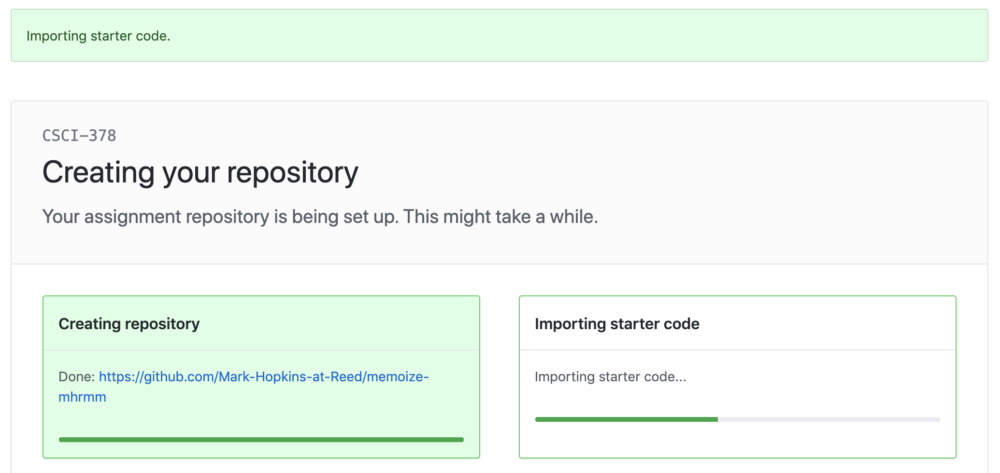

4. When your repository is ready, it will give you a link:

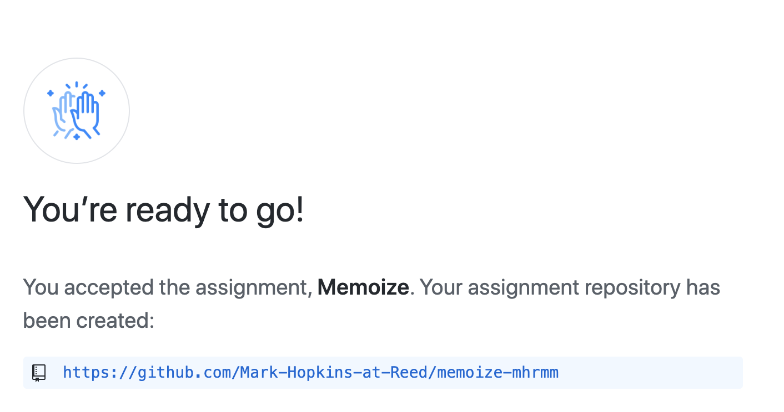

5. Follow the link to your repository and then click the green Clone button.
Then click the clipboard button to get your repository's URL:

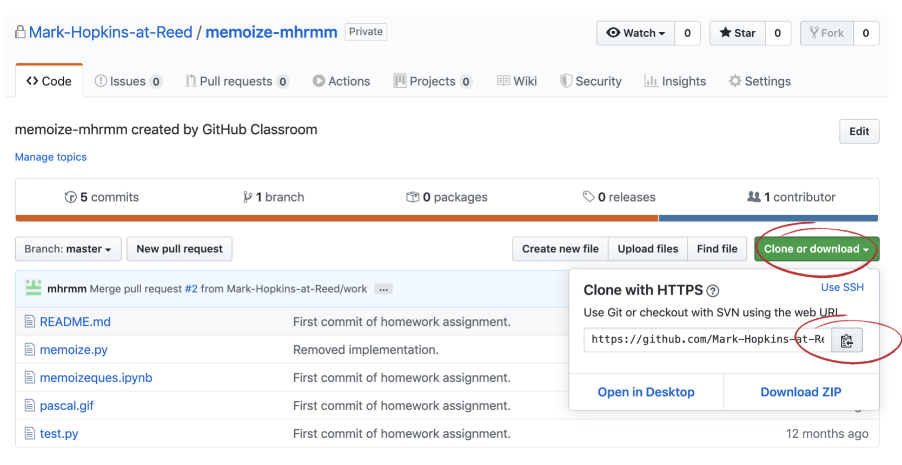

6. Open a Terminal window, navigate to a directory that you are using for
this class, then type

    git clone URL
    
where URL is whatever URL you copied using the clipboard button in the previous
step.

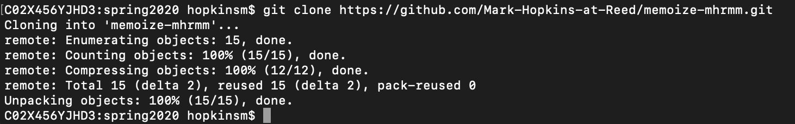

7. Change into the repo directory and then create and checkout a branch called "work":

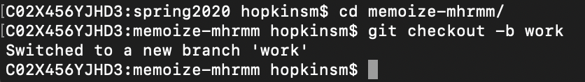

8. The top-level README.md will give you high-level instructions about how to do the
assignment, which will often going through a Jupyter notebook (i.e. .ipynb file):

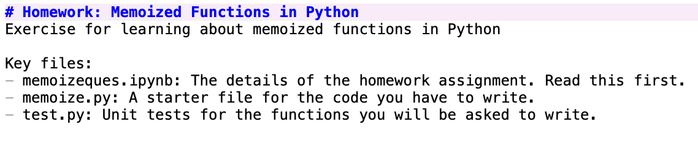

9. Open the notebook by typing ```jupyter notebook&``` into the Terminal window,
which will open a menu in your web browser from which you can choose the
appropriate .ipynb file.

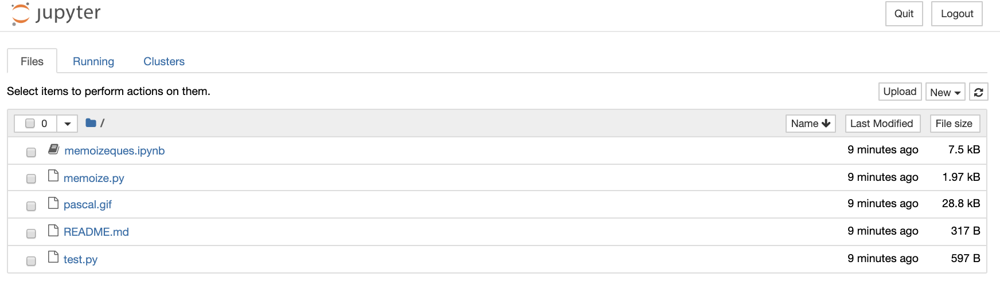

10. The Jupyter notebook will give further instructions about to complete
the assignment:

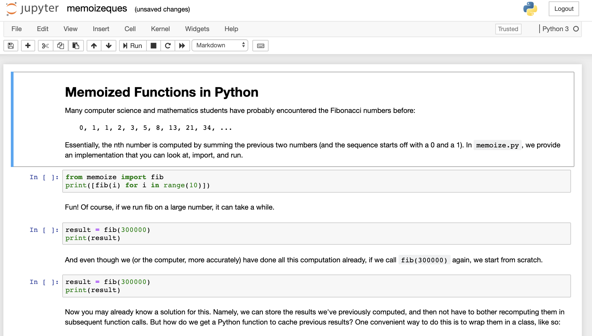

11. This will invariably involve modifying certain Python files. Once you have
successfully changed those files, do a ```git status``` from the Terminal
to look at which files you've changed.

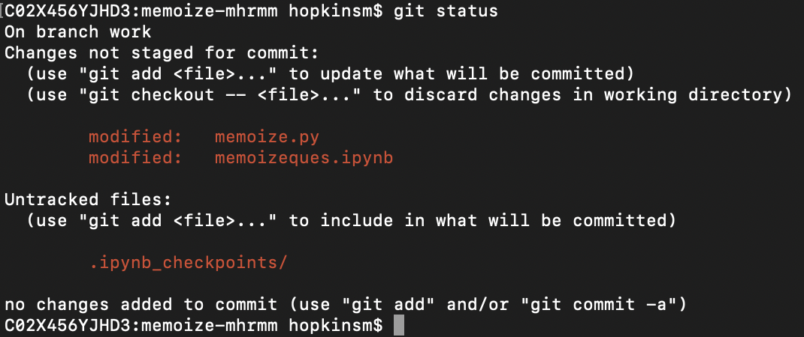

12. Add the files you want to submit using ```git add```:

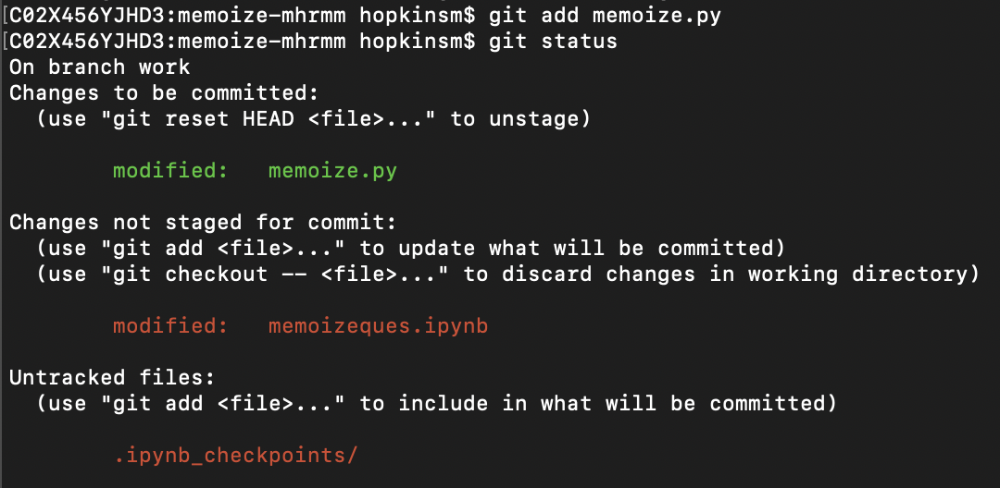

13. Then commit them and send them to Github:

    git commit -m "A BRIEF DESCRIPTION OF YOUR CHANGES"
    git push origin work

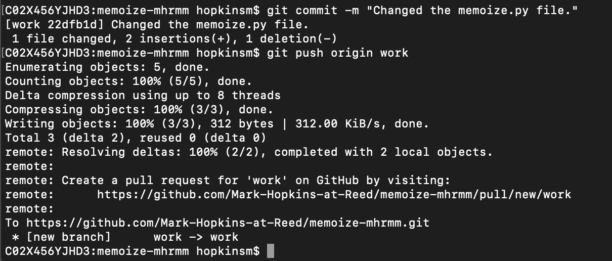

14. Returning to your Github repository, there should now be a yellow box
allowing you to make a pull request. Click the green box inside it that says
"Compare and Pull Request"

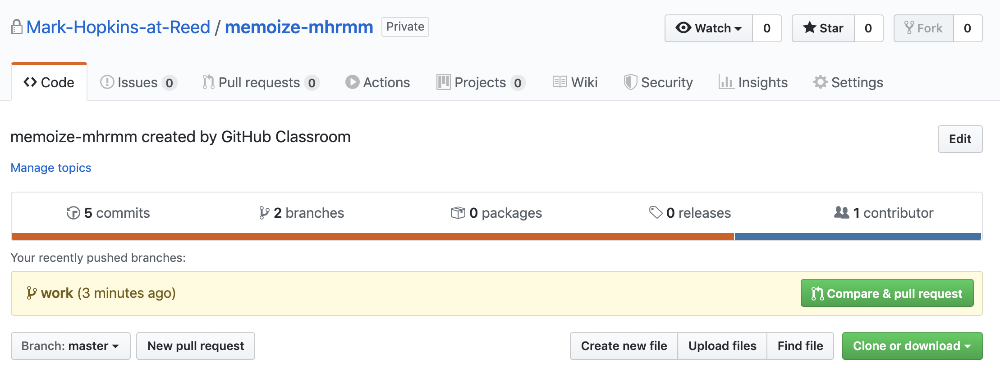

15. Finally, put my Github handle (@mhrmm) in the body of your pull request,
along with a short message to indicate completion. Click the green button
that says "Create Pull Request":

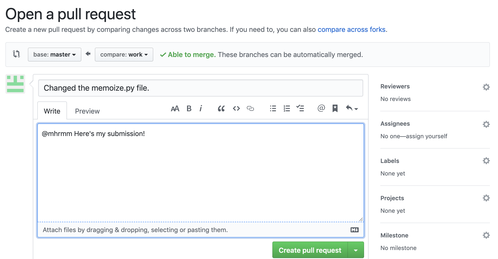

16. All done! I will get back to you with a grade shortly thereafter.

